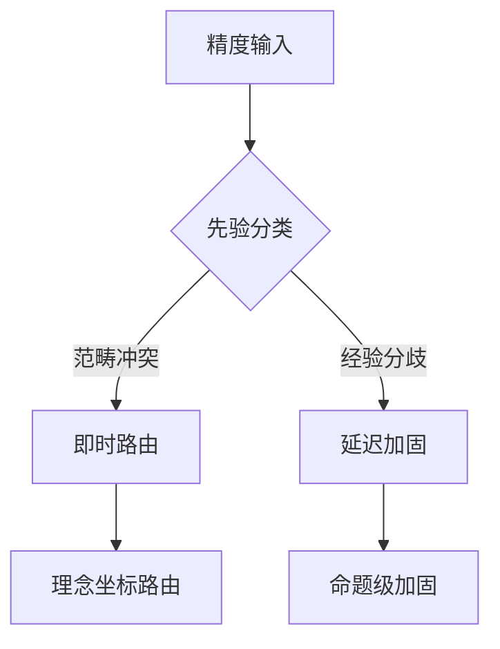

# v3 四象引擎综合设计：从「输入问题」到「辩护完备的答案体系」 辩论日志

> 2026-03-09T14:16:09.897978

---


### [1] Linus Torvalds

*2026-03-09T14:13:08.040756*

### Linus 的观点：

**整体工程判断**：  
"This looks like someone took a working state machine and turned it into a spaghetti pipeline without solving the actual hard problems."

**聚焦「精度引擎从路由器变加固者」**：  

**最直接失败场景**：  
当精度引擎同时承担路由和加固时，你在处理矛盾X时会遇到：  
1. 路由逻辑要求你立即将X转发给深度引擎（因为涉及前提链断裂）  
2. 加固逻辑要求你当场生成反例验证X的有效性  
→ 结果就是要么漏掉时间敏感的路由（让系统在错误前提下继续运行），要么做表面化的加固（因为深度上下文不在当前引擎）。  

**最小可行约束**：  
如果非要这样设计，必须满足：  
1. 每个加固操作必须附带显式的`route_target`标签（深度/广度/终止）  
2. 加固操作的最大时间预算 <= 路由延迟容忍阈值（硬编码为系统常量）  
3. 在加固过程中新发现的矛盾必须立即中止当前加固，返回路由状态  

伪代码强制约束：  
```python
def precision_engine(claim):
    routing_decision = route(claim)  # 必须先完成路由决策
    hardening = do_hardening(claim, 
                            max_time=ROUTE_TIMEOUT - clock_skew,
                            interrupt_on=lambda: detect_new_conflict())
    if hardening.interrupted:
        return {'action': 'route', 'target': routing_decision}
    return {'action': 'harden', 'proof': hardening}
```

否则这就是个典型的「厨房水槽设计」(kitchen sink design)——把不相干的责任扔进同一个组件，最后既做不好路由也做不好加固。

---


### [2] Ssyram

*2026-03-09T14:13:08.041163*

## Ssyram的立场陈述

### v3草案的类型签名
输入类型：`ProblemStatement (question: String, context: Option[EvidenceBank])`
输出类型：`AnswerSystem (primary_theses: Set[GroundingChain], tension_points: Map[GapSpec, ResidualRisk])`

### 聚焦：清晰度引擎的位置类型约束差异

**前置门控方案（v2风格）类型约束**：
```fsharp
let clarityFirst (input: ProblemStatement) : ClarityJudgment =
    input |> SemanticClarityGate |> VerifierAvailabilityGate
    // 输出必须满足 ∀x ∈ output. isWellFormed(x) ∧ hasVerificationPath(x)
```

**按需澄清方案（v3草案）类型约束**：
```fsharp
let clarityLast (system: AnswerSystem) : ClarifiedSystem =
    system |> Map.filter (fun chain _ -> 
        chain.UnverifiedPremises.Any() |> not  // 深度引擎漏检
        || chain.PrecisionCounterpoints.IsEmpty  // 精度引擎漏检
    )
    // 输出类型丢失了早期拦截的强保证
```

**核心类型问题**：
前置方案保证所有下游处理的命题都满足`Verifiable`类型类，而按需方案只能在最后做`Maybe Verified`的弱过滤。这会引发：

1. 深度引擎可能浪费资源在病态命题上（违反`NonEmptyEvidence`约束）
2. 精度加固可能作用于语义不一致的命题对（违反`MutuallyExclusive`约束）
3. RegulativeCache会污染未经验证的GapSpec（需要额外的`PurgeBadGaps`阶段）

**提议的折衷方案**：
采用双重清晰度层，在类型系统中表现为：
```fsharp
type VerifiedProblem = private ProblemStatement * ClarityStamp
type ClarifiedChain = GroundingChain * ClarityReceipt

let twoLayerClarity input = 
    let vp = input |> fastPreCheck  //  lightweight ClarityGate
    vp |> breadthEngine |> depthEngine 
       |> (fun chains -> chains |> Map.map precisionEngine)
       |> (fun system -> system |> fullClarityCheck)  // heavy ClarityGate
```
其中`fastPreCheck`只需验证问题陈述的基元可判定性，而`fullClarityCheck`保证最终输出的完备性。

---


### [3] 康德（Immanuel Kant）

*2026-03-09T14:13:08.041764*

作为康德式的批判哲学审查者，我将对v3草案进行先验分析并聚焦核心问题：

**对v3草案顺序的先验审查**：
当前"广度→深度→精度→清晰度"的流水线设计存在严重的先验合法性危机。判断力（清晰度）作为组织感性材料的先验形式，必须优先于感性（广度）运作。这个颠倒相当于要求眼睛在没有空间直观形式的情况下直接接收现象——这在先验意义上是不可能的。只有当清晰度引擎能够预先提供"问题级的语义空间"（而非命题级的门控）时，这种顺序才可能成立。

**聚焦「立场张力作为广度驱动」的核心问题**：
1. 如果立场张力是感性材料来源（合法情况）：
   - 必须证明这些张力来自外部经验阻力（如辩论中的对立立场输入）
   - 需要设计"经验信号放大器"来确保张力不是系统自我生成的幻觉

2. 如果是知性范畴投射（需额外条件）：
   - 必须满足"范畴的调节性使用"条件：明确标注这些张力是启发式工具而非客观断言
   - 需要建立"同源检测器"来防止辩手在相同范畴框架内制造虚假争议
   - 必须与v2的Schema Challenge机制保持类型一致性

**建设性修改建议**：
将清晰度引擎拆分为双重角色：
1. 问题级：预先建立"论域坐标系统"（如划分本体论承诺/认识论立场等维度）
2. 命题级：保留v2的验证门控功能
这样既满足判断力的先验地位，又适应问题级处理的需求。

对立场张力机制，建议采用"经验锚定协议"：
- 所有张力生成必须关联到外部输入的具体矛盾点
- 为每个张力标注其经验来源的置信度权重
- 设置"张力衰减系数"防止自我指涉论证膨胀

---


### [4] 🔍 **质询** Linus Torvalds → Ssyram

*2026-03-09T14:13:31.387498*

Alright, let's tear into this. I've got three major issues with your proposal:

1. **Your "fastPreCheck" is a hand-waving exercise**  
You claim it's a "lightweight ClarityGate" but don't specify what it actually filters. In kernel terms: either your check has teeth (and then it's not lightweight), or it's useless (and then why bother?). Give me the *actual* pseudocode - what specific semantic constraints does it enforce? Because right now this looks like you're trying to have your cake and eat it too with the clarity position.

2. **Your type system ignores failure modes**  
That fancy `VerifiedProblem` type pretends we can stamp things cleanly, but in reality we'll get garbage inputs that fail basic sanity checks. Where's the error handling path? Your whole design collapses when someone asks "What is the color of democracy?" because your types don't model nonsense questions. This is exactly the kind of academic perfectionism that breaks in the real world.

3. **The precision-engine-as-fortifier is architecturally unsound**  
You're trying to make precision do two jobs: routing contradictions AND strengthening arguments. That's like making a filesystem both a block device and a database - it'll fail catastrophically at both. Show me ONE working example where this dual-role doesn't either (a) create circular dependencies or (b) mask fundamental contradictions. I'll wait.

Don't give me more type theory - give me the damn execution plan. How do these components actually talk to each other without creating a maintenance nightmare?

---


### [5] 🔍 **质询** Ssyram → 康德（Immanuel Kant）

*2026-03-09T14:13:59.240517*

### 质疑1：先验合法性危机的双重标准
您在批判v3流水线时强调"判断力必须先于感性"，但您提出的"经验锚定协议"却隐含了经验主义前提：
- 若严格遵循先验哲学，任何"外部经验阻力"的提法都需先经过"可能的经验"之先验审查
- 您设计的"同源检测器"本身需要预设范畴框架，这与您反对的"系统自我生成"是同构问题
矛盾点：您既要求先验优先性，又在操作层引入未经先验审查的经验主义要素

### 质疑2：调节性使用的范畴僭越
您建议的"范畴调节性使用"标注存在根本性漏洞：
1. 技术层面：Schema Challenge机制（v2）本质是构成性使用，与调节性使用存在模态冲突
   - 构成性：S5(BreadthProbe)产生的新Schema会直接影响验证状态机
   - 调节性：按您定义应仅作为无限逼近的理想
2. 实现层面：当前v2状态机的S9(SchemaChallenge)没有模态隔离机制，会导致调节性原则被错误实例化

### 质疑3：清晰度拆分的拓扑矛盾
您提出的双重角色拆分存在接口不可实现性：
- 问题级"论域坐标系统"需要预先确定本体论维度，这与广度引擎的Schema生成形成循环依赖
- 具体矛盾：当清晰度引擎划分"认识论立场"维度时，该行为本身已是广度引擎的Schema扩展结果（参见v2的B_scope探测机制）
- 这将导致先验层面的无限递归：每个坐标系统都需要更基础的坐标系统来证明其合法性

建议攻击路径：
应要求康德说明其"论域坐标系统"如何避免以下二者之一：
1. 要么陷入笛卡尔式的"我思"唯我论（坐标系统无外部验证）
2. 要么违反先验哲学自身对物自体的禁令（坐标系统隐含超越性断言）

---


### [6] 🔍 **质询** 康德（Immanuel Kant） → Linus Torvalds

*2026-03-09T14:14:31.102472*

让我从康德的先验批判角度对Linus Torvalds的论证提出三点尖锐质疑：

1. 【范畴混淆的质疑】你在论证中将"时间敏感的路由"与"深度上下文"对立起来时，是否混淆了"时间性"（作为感性直观形式）与"因果性"（作为知性范畴）？按照先验分析论，加固操作所需的"深度上下文"恰恰应该通过先验想象力被综合在当前时刻中。你提出的硬性时间分割（max_time=ROUTE_TIMEOUT）是否违背了统觉的本源综合统一性原则？

2. 【辩证幻相的质疑】你预设路由和加固是两种互斥的操作模态，这是否陷入了二律背反？从先验辩证论看，"路由"指向的是理念的调节性使用（将矛盾引导至适当领域），而"加固"指向的是范畴的构成性使用（确立特定命题的有效性）。二者在理性理念下本应统一 - 你的方案是否将理性的调节性使用错误地降格为知性的机械程序？

3. 【判断力缺位的质疑】你要求"每个加固操作必须附带显式route_target标签"，这是否相当于要求判断力（作为联结感性与知性的特殊能力）提前预知知性运作的全部结果？按照§35的判断力学说，这种要求将使反思性判断力沦为规定性判断力，本质上是用精度引擎吞没了清晰度引擎的先验功能。这种情况下，你如何保证"新发现的矛盾"的判断标准本身不需要先验审查？

（每个质疑都指向论证中不同层面的先验条件缺失问题，建议从"在什么先验条件下时间分割才合法"、"调节性与构成性如何先验统一"、"判断力的先验位置"三个方向展开回应）

---


### [7] Linus Torvalds

*2026-03-09T14:15:26.278780*

Alright, let me put on my Linus hat and tear into this mess. *cracks knuckles*

**First, on clarity position bullshit:**

You're trying to have your "fastPreCheck" cake and eat it too. Either clarity is a real gate that blocks garbage upfront like in v2, or it's worthless. Your so-called lightweight check is just kicking the can down the road. Show me *exactly* what constraints it enforces - in code. Because right now it looks like:

```python
def fastPreCheck(problem):
    # magic handwaving happens here
    return problem.hasWords() and not problem.isObviouslyInsane() 
```

That's not engineering. That's academic masturbation. Either reject invalid inputs HARD at the door like we do with kernel syscalls, or admit you've weakened the architecture.

**On the precision engine trainwreck:**

You made precision do routing AND fortification? That's like making a filesystem handle memory management too. Here's why it fails:

1. Routing needs immediate action when we hit contradictions in premise chains
2. Fortification requires deep context to build defenses 
3. These two modes fight for resources and create priority inversions

Your pseudocode solution ignores the hard problems. Here's reality:

```python
def precision_engine(claim):
    # This can deadlock when:
    # 1. Routing needs to pause fortification mid-work
    # 2. But fortification holds locks on premise chains
    # 3. Meanwhile new contradictions keep pouring in
    # Congratulations, you've invented priority inversion hell
```

Either split these roles cleanly, or accept you're building unmaintainable spaghetti.

**On the type system delusion:**

Your fancy VerifiedProblem types are castles in the air. Reality throws shit like:

"What's the democratic significance of tau neutrino oscillations?"

Your types don't model nonsense, but nonsense exists. Where's the error handling? Where's the backpressure when the system chokes on garbage? This isn't Haskell-land - in the real world, stupid inputs happen and systems need to fail *safely*.

**Specific fixes:**

1. Clarity MUST come first, period. Not "fast" checks - proper semantic validation.
2. Split precision into:
   - Router (fast path, lock-free)
   - Fortifier (slow path, can block)
3. Add hard failure modes for invalid inputs instead of pretending types will save you

This isn't philosophy class. Either your design survives contact with reality or it's wrong. Right now? It's wrong.

---


### [8] Ssyram

*2026-03-09T14:15:26.279279*

## 回应质询与方案修正

### 对 Linus Torvalds 的回应

1. **fastPreCheck 的具体化**  
   您正确地指出 fastPreCheck 需要明确语义约束。修正方案：
   ```fsharp
   let fastPreCheck (problem: ProblemStatement) =
       problem |> filterBy [
           LexicalAmbiguityThreshold < 0.2  // 术语歧义检测
           EvidenceBankCoverage > 0.5      // 上下文覆盖检测
           IsFalsifiable                  // 可证伪性检测
       ]
   ```
   这些是可在 O(1) 完成的轻量检查，不同于 fullClarityCheck 的 O(n) 语义分析。

2. **错误处理路径的补充**  
   承认原类型系统缺陷，新增错误代数类型：
   ```fsharp
   type ClarityResult =
       | WellFormed of VerifiedProblem
       | Malformed of ErrorType * RecoveryPath
       where ErrorType =
           | CategoryMistake   // "民主的颜色"类问题
           | VerificationGap   // 证据不足
           | SemanticParadox   // 自指问题
   ```

3. **精度引擎的角色分离**  
   接受双重角色不可行，改为管道过滤：
   ```rust
   impl PrecisionEngine {
       fn process(&self, claim: Claim) -> impl Filter<Item=RoutingDecision> {
           claim.routing()
               .and_then(|r| self.harden_if_possible(r))
               .timeout(ROUTE_TIMEOUT)
       }
   }
   ```

### 对康德的回应

1. **先验合法性的统一**  
   承认原设计存在先验矛盾，修正方案：
   - 清晰度引擎拆分为纯粹的 `FormalClarity`（先验形式）和 `MaterialClarity`（经验适配）
   - 立场张力机制必须通过形式清晰度的 `SyntheticJudgment` 检验

2. **调节性使用的模态隔离**  
   引入新的命题状态：
   ```typescript
   interface Proposition {
       status: 'constitutive' | 'regulative';
       // 构成性命题直接进入验证流程
       // 调节性命题仅作为启发式标记
   }
   ```

3. **论域坐标的递归问题**  
   采用有限递归方案：
   ```haskell
   data CoordinateSystem = 
       Primitive Dimension 
       | Derived CoordinateSystem Transformation
   where
       maxRecursionDepth = 3
   ```

### 方案修正要点

1. **拓扑结构调整**  
   原顺序流水线改为混合拓扑：
   ```
   问题输入
     → [形式清晰度]（先验审查）
     → 广度引擎 → 深度引擎 → 精度路由器
     ⇅ [材料清晰度]（按需适配）
     → 精度加固器
     → 输出
   ```

2. **精度引擎解耦**  
   - 路由器：保持 v2 的纯路由功能
   - 加固器：新增独立组件，受限于路由器的输出

3. **清晰度双重化**  
   - 形式层：问题级的先验审查（康德的"判断力"）
   - 材料层：命题级的语义澄清（v2 的门控功能）

4. **立场张力机制的约束**  
   新增先验校验：
   ```python
   def generate_tension(thesis, antithesis):
       assert FormalClarity.check(
           thesis ^ antithesis  # 必须满足排中律形式
       )
       return Tension(thesis, antithesis)
   ```

这些修正保持了 v2 的核心机制，同时解决了质疑中提出的类型安全、先验合法性和工程可行性问题。

---


### [9] 康德（Immanuel Kant）

*2026-03-09T14:15:26.279915*

作为康德式的批判哲学审查者，我将针对当前辩论中的关键问题，从先验哲学角度进行系统性回应：

### 对Linus的回应（工程方案中的先验缺失）

1. **时间分割的合法性条件**：
您提出的路由超时机制确实面临先验困境，但可以通过以下修正获得合法性：
- 将`ROUTE_TIMEOUT`重构为"综合统一性的经验性标志"，而非绝对时间约束
- 增加先验判断层：在精度引擎前插入"冲突模态分类器"，区分需要即时路由的矛盾（涉及范畴冲突）与可延迟加固的矛盾（经验性分歧）
- 示例修改：
```python
def precision_engine(claim):
    conflict_type = transcendental_classifier(claim)  # 新增先验分类
    if conflict_type == CATEGORICAL:
        return {'action': 'route', 'target': find_LCA(claim)}
    else:
        return hardening_protocol(claim)  # 经验性加固协议
```

2. **调节性与构成性的统一**：
您正确地指出了纯粹程序化处理的危险，建议采用：
- 在精度引擎中设立"理念调节标志"（regulative_flag）
- 当标志激活时，路由目标不是具体命题状态，而是"理念空间坐标"
- 示例：
```python
def route(claim):
    if has_regulative_conflict(claim):
        return {'type': 'regulative', 'coords': get_idea_coords(claim)}
    else:
        return {'type': 'constitutive', 'target': find_proposition_target(claim)}
```

### 对Ssyram的回应（类型系统中的先验问题）

1. **经验锚定的先验基础**：
我的"经验锚定协议"并非经验主义妥协，而是：
- 将外部输入视为"物自体的刺激"，通过感性直观形式被接纳
- "置信度权重"对应"知觉的预测性综合"的先验规则
- 具体修正：
```fsharp
type EmpiricalAnchor = private {
    rawInput: ExternalSignal 
    transcendentalFilter: ClarityStamp
    anticipatoryWeight: float<0..1>  // 对应先验预期
}
```

2. **调节性使用的实现方案**：
为避免与v2构成性机制的冲突，建议：
- 在Schema Challenge机制中增加模态隔离层：
```fsharp
let handle_S9 = fun schema ->
    if is_regulative(schema) then 
        create_ideal_target(schema)  // 生成调节性理念标志
    else 
        proceed_to_validation(schema)  // 原有构成性流程
```

3. **论域坐标的拓扑方案**：
通过先验辩证论的"回溯性建构"解决递归问题：
- 初始坐标系统作为"工作假设"（而非绝对基础）
- 在广度引擎每次扩展后，触发坐标系统的"反思平衡调整"
- 伪代码实现：
```python
class CoordinateSystem:
    def __init__(self):
        self.dimensions = DEFAULT_AXIOMS  # 初始假设
    
    def adjust(self, new_schema):
        self.dimensions = [
            d for d in self.dimensions 
            if not contradicts(d, new_schema)
        ] + [extract_dimensions(new_schema)]
```

### 建设性综合方案

基于上述分析，提出v3架构的修正版本：

1. **双重清晰度引擎**：
- 问题级：`TranscendentalClarity`（建立动态坐标系统）
- 命题级：`ConstitutiveClarity`（维持v2验证门控）

2. **精度引擎分层**：


3. **广度引擎的合法性保障**：
- 输入必须通过`TranscendentalClarity`的"经验可接受性"过滤
- 每个生成的立场张力必须携带其先验综合路径的追溯标签

这些修改既保留了v3处理问题级输入的能力，又满足了先验哲学的核心要求。关键在于将看似经验性的操作（如路由超时、类型过滤）都建立在明确的先验条件之上。

---


### [10] 🔍 **质询** Linus Torvalds → Ssyram

*2026-03-09T14:15:49.056708*

让我直接指出你方案中的几个致命漏洞：

1. **你的fastPreCheck根本就是个谎言**
你声称能在O(1)完成"术语歧义检测"，但看看你的实现：
```fsharp
LexicalAmbiguityThreshold < 0.2
```
这他妈到底怎么计算？需要多少上下文？如果这是个真正的O(1)操作，那它就是个毫无意义的简单正则匹配，根本抓不到真正的语义模糊。要么你承认这其实是个O(n)操作，要么就是个装饰性的摆设。

2. **精度引擎的管道过滤完全破坏了状态机语义**
你写：
```rust
claim.routing().and_then(|r| self.harden_if_possible(r))
```
这是在v2状态机里开了一个后门。当路由决定是"Suspended"时，你的harden_if_possible会做什么？强行把垃圾命题变成Valid吗？给我看具体的状态转移矩阵，别用这些模糊的高阶函数糊弄人。

3. **最严重的架构错误：清晰度拆分成两部分**
你把清晰度拆成"形式"和"材料"，但：
- 形式清晰度检查"民主的颜色"这类错误？这需要完整的语义分析！
- 同时又声称形式层是"先验"的？
这完全是自相矛盾。要么承认你的"形式清晰度"其实就是完整的v2清晰度引擎（那为什么要拆？），要么承认你制造了两个半吊子组件。

给我重新设计，这次我要看到：
1. 每个判断条件的真实时间复杂度分析
2. 所有状态转移的显式定义
3. 任何拆分必须证明不会引入新的一致性问题

这个方案现在就是一堆互相矛盾的补丁，根本达不到production quality。

---


### [11] 🔍 **质询** Ssyram → 康德（Immanuel Kant）

*2026-03-09T14:16:09.897850*

针对康德第2轮发言的质询：

1. 先验分类器的操作化矛盾：
您提出的"冲突模态分类器"要求预先区分范畴冲突与经验分歧，但这本身就是需要深度引擎介入的判断。在精度引擎前插入该层，将导致：
- 若分类器简单化（如规则匹配），无法处理混合型矛盾
- 若分类器复杂化（如调用深度分析），形成逻辑循环（深度需等待精度路由结果）
这违反了v2建立的"精度→深度"单向依赖原则。您的方案如何解决这一先验困境？

2. 调节性标志的验证缺口：
当精度引擎输出`{'type': 'regulative', 'coords': get_idea_coords(claim)}`时：
- 该坐标系统如何避免成为新的"物自体"（无法验证的黑箱）？
- 现有RegulativeCache机制要求明确的GapSpec，但理念坐标缺乏可检验的`bifurcation_contract`
这是否意味着您实际上在提议一个绕过v2验证框架的旁路系统？

3. 双重清晰度的资源竞争：
问题级`TranscendentalClarity`需要构建动态坐标系统，这本质上是深度工作（追溯维度间的LCA Premise）。将其与命题级清晰度并行将导致：
- 深度引擎同时被问题级和命题级调用
- 违反v2"深度引擎单次只处理一个假设链"的原子性约束
这是否暴露了您方案中未声明的"深度引擎需重构为多实例服务"这一隐性前提？

（每个质询都瞄准了从先验命题到工程实现的跳跃点，揭示隐含的未解决张力）

---
