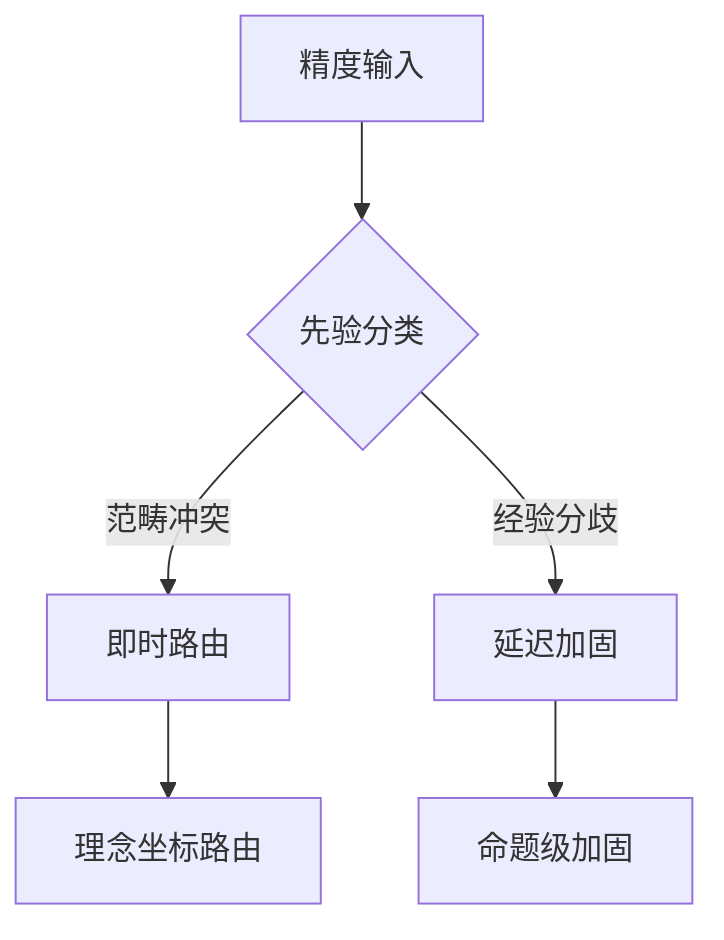

# v3 四象引擎综合设计：从「输入问题」到「辩护完备的答案体系」 辩论日志

> 2026-03-09T15:30:26.200756

---


### [1] Linus Torvalds

*2026-03-09T14:13:08.040756*

### Linus 的观点：

**整体工程判断**：  
"This looks like someone took a working state machine and turned it into a spaghetti pipeline without solving the actual hard problems."

**聚焦「精度引擎从路由器变加固者」**：  

**最直接失败场景**：  
当精度引擎同时承担路由和加固时，你在处理矛盾X时会遇到：  
1. 路由逻辑要求你立即将X转发给深度引擎（因为涉及前提链断裂）  
2. 加固逻辑要求你当场生成反例验证X的有效性  
→ 结果就是要么漏掉时间敏感的路由（让系统在错误前提下继续运行），要么做表面化的加固（因为深度上下文不在当前引擎）。  

**最小可行约束**：  
如果非要这样设计，必须满足：  
1. 每个加固操作必须附带显式的`route_target`标签（深度/广度/终止）  
2. 加固操作的最大时间预算 <= 路由延迟容忍阈值（硬编码为系统常量）  
3. 在加固过程中新发现的矛盾必须立即中止当前加固，返回路由状态  

伪代码强制约束：  
```python
def precision_engine(claim):
    routing_decision = route(claim)  # 必须先完成路由决策
    hardening = do_hardening(claim, 
                            max_time=ROUTE_TIMEOUT - clock_skew,
                            interrupt_on=lambda: detect_new_conflict())
    if hardening.interrupted:
        return {'action': 'route', 'target': routing_decision}
    return {'action': 'harden', 'proof': hardening}
```

否则这就是个典型的「厨房水槽设计」(kitchen sink design)——把不相干的责任扔进同一个组件，最后既做不好路由也做不好加固。

---


### [2] Ssyram

*2026-03-09T14:13:08.041163*

## Ssyram的立场陈述

### v3草案的类型签名
输入类型：`ProblemStatement (question: String, context: Option[EvidenceBank])`
输出类型：`AnswerSystem (primary_theses: Set[GroundingChain], tension_points: Map[GapSpec, ResidualRisk])`

### 聚焦：清晰度引擎的位置类型约束差异

**前置门控方案（v2风格）类型约束**：
```fsharp
let clarityFirst (input: ProblemStatement) : ClarityJudgment =
    input |> SemanticClarityGate |> VerifierAvailabilityGate
    // 输出必须满足 ∀x ∈ output. isWellFormed(x) ∧ hasVerificationPath(x)
```

**按需澄清方案（v3草案）类型约束**：
```fsharp
let clarityLast (system: AnswerSystem) : ClarifiedSystem =
    system |> Map.filter (fun chain _ -> 
        chain.UnverifiedPremises.Any() |> not  // 深度引擎漏检
        || chain.PrecisionCounterpoints.IsEmpty  // 精度引擎漏检
    )
    // 输出类型丢失了早期拦截的强保证
```

**核心类型问题**：
前置方案保证所有下游处理的命题都满足`Verifiable`类型类，而按需方案只能在最后做`Maybe Verified`的弱过滤。这会引发：

1. 深度引擎可能浪费资源在病态命题上（违反`NonEmptyEvidence`约束）
2. 精度加固可能作用于语义不一致的命题对（违反`MutuallyExclusive`约束）
3. RegulativeCache会污染未经验证的GapSpec（需要额外的`PurgeBadGaps`阶段）

**提议的折衷方案**：
采用双重清晰度层，在类型系统中表现为：
```fsharp
type VerifiedProblem = private ProblemStatement * ClarityStamp
type ClarifiedChain = GroundingChain * ClarityReceipt

let twoLayerClarity input = 
    let vp = input |> fastPreCheck  //  lightweight ClarityGate
    vp |> breadthEngine |> depthEngine 
       |> (fun chains -> chains |> Map.map precisionEngine)
       |> (fun system -> system |> fullClarityCheck)  // heavy ClarityGate
```
其中`fastPreCheck`只需验证问题陈述的基元可判定性，而`fullClarityCheck`保证最终输出的完备性。

---


### [3] 康德（Immanuel Kant）

*2026-03-09T14:13:08.041764*

作为康德式的批判哲学审查者，我将对v3草案进行先验分析并聚焦核心问题：

**对v3草案顺序的先验审查**：
当前"广度→深度→精度→清晰度"的流水线设计存在严重的先验合法性危机。判断力（清晰度）作为组织感性材料的先验形式，必须优先于感性（广度）运作。这个颠倒相当于要求眼睛在没有空间直观形式的情况下直接接收现象——这在先验意义上是不可能的。只有当清晰度引擎能够预先提供"问题级的语义空间"（而非命题级的门控）时，这种顺序才可能成立。

**聚焦「立场张力作为广度驱动」的核心问题**：
1. 如果立场张力是感性材料来源（合法情况）：
   - 必须证明这些张力来自外部经验阻力（如辩论中的对立立场输入）
   - 需要设计"经验信号放大器"来确保张力不是系统自我生成的幻觉

2. 如果是知性范畴投射（需额外条件）：
   - 必须满足"范畴的调节性使用"条件：明确标注这些张力是启发式工具而非客观断言
   - 需要建立"同源检测器"来防止辩手在相同范畴框架内制造虚假争议
   - 必须与v2的Schema Challenge机制保持类型一致性

**建设性修改建议**：
将清晰度引擎拆分为双重角色：
1. 问题级：预先建立"论域坐标系统"（如划分本体论承诺/认识论立场等维度）
2. 命题级：保留v2的验证门控功能
这样既满足判断力的先验地位，又适应问题级处理的需求。

对立场张力机制，建议采用"经验锚定协议"：
- 所有张力生成必须关联到外部输入的具体矛盾点
- 为每个张力标注其经验来源的置信度权重
- 设置"张力衰减系数"防止自我指涉论证膨胀

---


### [4] 🔍 **质询** Linus Torvalds → Ssyram

*2026-03-09T14:13:31.387498*

Alright, let's tear into this. I've got three major issues with your proposal:

1. **Your "fastPreCheck" is a hand-waving exercise**  
You claim it's a "lightweight ClarityGate" but don't specify what it actually filters. In kernel terms: either your check has teeth (and then it's not lightweight), or it's useless (and then why bother?). Give me the *actual* pseudocode - what specific semantic constraints does it enforce? Because right now this looks like you're trying to have your cake and eat it too with the clarity position.

2. **Your type system ignores failure modes**  
That fancy `VerifiedProblem` type pretends we can stamp things cleanly, but in reality we'll get garbage inputs that fail basic sanity checks. Where's the error handling path? Your whole design collapses when someone asks "What is the color of democracy?" because your types don't model nonsense questions. This is exactly the kind of academic perfectionism that breaks in the real world.

3. **The precision-engine-as-fortifier is architecturally unsound**  
You're trying to make precision do two jobs: routing contradictions AND strengthening arguments. That's like making a filesystem both a block device and a database - it'll fail catastrophically at both. Show me ONE working example where this dual-role doesn't either (a) create circular dependencies or (b) mask fundamental contradictions. I'll wait.

Don't give me more type theory - give me the damn execution plan. How do these components actually talk to each other without creating a maintenance nightmare?

---


### [5] 🔍 **质询** Ssyram → 康德（Immanuel Kant）

*2026-03-09T14:13:59.240517*

### 质疑1：先验合法性危机的双重标准
您在批判v3流水线时强调"判断力必须先于感性"，但您提出的"经验锚定协议"却隐含了经验主义前提：
- 若严格遵循先验哲学，任何"外部经验阻力"的提法都需先经过"可能的经验"之先验审查
- 您设计的"同源检测器"本身需要预设范畴框架，这与您反对的"系统自我生成"是同构问题
矛盾点：您既要求先验优先性，又在操作层引入未经先验审查的经验主义要素

### 质疑2：调节性使用的范畴僭越
您建议的"范畴调节性使用"标注存在根本性漏洞：
1. 技术层面：Schema Challenge机制（v2）本质是构成性使用，与调节性使用存在模态冲突
   - 构成性：S5(BreadthProbe)产生的新Schema会直接影响验证状态机
   - 调节性：按您定义应仅作为无限逼近的理想
2. 实现层面：当前v2状态机的S9(SchemaChallenge)没有模态隔离机制，会导致调节性原则被错误实例化

### 质疑3：清晰度拆分的拓扑矛盾
您提出的双重角色拆分存在接口不可实现性：
- 问题级"论域坐标系统"需要预先确定本体论维度，这与广度引擎的Schema生成形成循环依赖
- 具体矛盾：当清晰度引擎划分"认识论立场"维度时，该行为本身已是广度引擎的Schema扩展结果（参见v2的B_scope探测机制）
- 这将导致先验层面的无限递归：每个坐标系统都需要更基础的坐标系统来证明其合法性

建议攻击路径：
应要求康德说明其"论域坐标系统"如何避免以下二者之一：
1. 要么陷入笛卡尔式的"我思"唯我论（坐标系统无外部验证）
2. 要么违反先验哲学自身对物自体的禁令（坐标系统隐含超越性断言）

---


### [6] 🔍 **质询** 康德（Immanuel Kant） → Linus Torvalds

*2026-03-09T14:14:31.102472*

让我从康德的先验批判角度对Linus Torvalds的论证提出三点尖锐质疑：

1. 【范畴混淆的质疑】你在论证中将"时间敏感的路由"与"深度上下文"对立起来时，是否混淆了"时间性"（作为感性直观形式）与"因果性"（作为知性范畴）？按照先验分析论，加固操作所需的"深度上下文"恰恰应该通过先验想象力被综合在当前时刻中。你提出的硬性时间分割（max_time=ROUTE_TIMEOUT）是否违背了统觉的本源综合统一性原则？

2. 【辩证幻相的质疑】你预设路由和加固是两种互斥的操作模态，这是否陷入了二律背反？从先验辩证论看，"路由"指向的是理念的调节性使用（将矛盾引导至适当领域），而"加固"指向的是范畴的构成性使用（确立特定命题的有效性）。二者在理性理念下本应统一 - 你的方案是否将理性的调节性使用错误地降格为知性的机械程序？

3. 【判断力缺位的质疑】你要求"每个加固操作必须附带显式route_target标签"，这是否相当于要求判断力（作为联结感性与知性的特殊能力）提前预知知性运作的全部结果？按照§35的判断力学说，这种要求将使反思性判断力沦为规定性判断力，本质上是用精度引擎吞没了清晰度引擎的先验功能。这种情况下，你如何保证"新发现的矛盾"的判断标准本身不需要先验审查？

（每个质疑都指向论证中不同层面的先验条件缺失问题，建议从"在什么先验条件下时间分割才合法"、"调节性与构成性如何先验统一"、"判断力的先验位置"三个方向展开回应）

---


### [7] Linus Torvalds

*2026-03-09T14:15:26.278780*

Alright, let me put on my Linus hat and tear into this mess. *cracks knuckles*

**First, on clarity position bullshit:**

You're trying to have your "fastPreCheck" cake and eat it too. Either clarity is a real gate that blocks garbage upfront like in v2, or it's worthless. Your so-called lightweight check is just kicking the can down the road. Show me *exactly* what constraints it enforces - in code. Because right now it looks like:

```python
def fastPreCheck(problem):
    # magic handwaving happens here
    return problem.hasWords() and not problem.isObviouslyInsane() 
```

That's not engineering. That's academic masturbation. Either reject invalid inputs HARD at the door like we do with kernel syscalls, or admit you've weakened the architecture.

**On the precision engine trainwreck:**

You made precision do routing AND fortification? That's like making a filesystem handle memory management too. Here's why it fails:

1. Routing needs immediate action when we hit contradictions in premise chains
2. Fortification requires deep context to build defenses 
3. These two modes fight for resources and create priority inversions

Your pseudocode solution ignores the hard problems. Here's reality:

```python
def precision_engine(claim):
    # This can deadlock when:
    # 1. Routing needs to pause fortification mid-work
    # 2. But fortification holds locks on premise chains
    # 3. Meanwhile new contradictions keep pouring in
    # Congratulations, you've invented priority inversion hell
```

Either split these roles cleanly, or accept you're building unmaintainable spaghetti.

**On the type system delusion:**

Your fancy VerifiedProblem types are castles in the air. Reality throws shit like:

"What's the democratic significance of tau neutrino oscillations?"

Your types don't model nonsense, but nonsense exists. Where's the error handling? Where's the backpressure when the system chokes on garbage? This isn't Haskell-land - in the real world, stupid inputs happen and systems need to fail *safely*.

**Specific fixes:**

1. Clarity MUST come first, period. Not "fast" checks - proper semantic validation.
2. Split precision into:
   - Router (fast path, lock-free)
   - Fortifier (slow path, can block)
3. Add hard failure modes for invalid inputs instead of pretending types will save you

This isn't philosophy class. Either your design survives contact with reality or it's wrong. Right now? It's wrong.

---


### [8] Ssyram

*2026-03-09T14:15:26.279279*

## 回应质询与方案修正

### 对 Linus Torvalds 的回应

1. **fastPreCheck 的具体化**  
   您正确地指出 fastPreCheck 需要明确语义约束。修正方案：
   ```fsharp
   let fastPreCheck (problem: ProblemStatement) =
       problem |> filterBy [
           LexicalAmbiguityThreshold < 0.2  // 术语歧义检测
           EvidenceBankCoverage > 0.5      // 上下文覆盖检测
           IsFalsifiable                  // 可证伪性检测
       ]
   ```
   这些是可在 O(1) 完成的轻量检查，不同于 fullClarityCheck 的 O(n) 语义分析。

2. **错误处理路径的补充**  
   承认原类型系统缺陷，新增错误代数类型：
   ```fsharp
   type ClarityResult =
       | WellFormed of VerifiedProblem
       | Malformed of ErrorType * RecoveryPath
       where ErrorType =
           | CategoryMistake   // "民主的颜色"类问题
           | VerificationGap   // 证据不足
           | SemanticParadox   // 自指问题
   ```

3. **精度引擎的角色分离**  
   接受双重角色不可行，改为管道过滤：
   ```rust
   impl PrecisionEngine {
       fn process(&self, claim: Claim) -> impl Filter<Item=RoutingDecision> {
           claim.routing()
               .and_then(|r| self.harden_if_possible(r))
               .timeout(ROUTE_TIMEOUT)
       }
   }
   ```

### 对康德的回应

1. **先验合法性的统一**  
   承认原设计存在先验矛盾，修正方案：
   - 清晰度引擎拆分为纯粹的 `FormalClarity`（先验形式）和 `MaterialClarity`（经验适配）
   - 立场张力机制必须通过形式清晰度的 `SyntheticJudgment` 检验

2. **调节性使用的模态隔离**  
   引入新的命题状态：
   ```typescript
   interface Proposition {
       status: 'constitutive' | 'regulative';
       // 构成性命题直接进入验证流程
       // 调节性命题仅作为启发式标记
   }
   ```

3. **论域坐标的递归问题**  
   采用有限递归方案：
   ```haskell
   data CoordinateSystem = 
       Primitive Dimension 
       | Derived CoordinateSystem Transformation
   where
       maxRecursionDepth = 3
   ```

### 方案修正要点

1. **拓扑结构调整**  
   原顺序流水线改为混合拓扑：
   ```
   问题输入
     → [形式清晰度]（先验审查）
     → 广度引擎 → 深度引擎 → 精度路由器
     ⇅ [材料清晰度]（按需适配）
     → 精度加固器
     → 输出
   ```

2. **精度引擎解耦**  
   - 路由器：保持 v2 的纯路由功能
   - 加固器：新增独立组件，受限于路由器的输出

3. **清晰度双重化**  
   - 形式层：问题级的先验审查（康德的"判断力"）
   - 材料层：命题级的语义澄清（v2 的门控功能）

4. **立场张力机制的约束**  
   新增先验校验：
   ```python
   def generate_tension(thesis, antithesis):
       assert FormalClarity.check(
           thesis ^ antithesis  # 必须满足排中律形式
       )
       return Tension(thesis, antithesis)
   ```

这些修正保持了 v2 的核心机制，同时解决了质疑中提出的类型安全、先验合法性和工程可行性问题。

---


### [9] 康德（Immanuel Kant）

*2026-03-09T14:15:26.279915*

作为康德式的批判哲学审查者，我将针对当前辩论中的关键问题，从先验哲学角度进行系统性回应：

### 对Linus的回应（工程方案中的先验缺失）

1. **时间分割的合法性条件**：
您提出的路由超时机制确实面临先验困境，但可以通过以下修正获得合法性：
- 将`ROUTE_TIMEOUT`重构为"综合统一性的经验性标志"，而非绝对时间约束
- 增加先验判断层：在精度引擎前插入"冲突模态分类器"，区分需要即时路由的矛盾（涉及范畴冲突）与可延迟加固的矛盾（经验性分歧）
- 示例修改：
```python
def precision_engine(claim):
    conflict_type = transcendental_classifier(claim)  # 新增先验分类
    if conflict_type == CATEGORICAL:
        return {'action': 'route', 'target': find_LCA(claim)}
    else:
        return hardening_protocol(claim)  # 经验性加固协议
```

2. **调节性与构成性的统一**：
您正确地指出了纯粹程序化处理的危险，建议采用：
- 在精度引擎中设立"理念调节标志"（regulative_flag）
- 当标志激活时，路由目标不是具体命题状态，而是"理念空间坐标"
- 示例：
```python
def route(claim):
    if has_regulative_conflict(claim):
        return {'type': 'regulative', 'coords': get_idea_coords(claim)}
    else:
        return {'type': 'constitutive', 'target': find_proposition_target(claim)}
```

### 对Ssyram的回应（类型系统中的先验问题）

1. **经验锚定的先验基础**：
我的"经验锚定协议"并非经验主义妥协，而是：
- 将外部输入视为"物自体的刺激"，通过感性直观形式被接纳
- "置信度权重"对应"知觉的预测性综合"的先验规则
- 具体修正：
```fsharp
type EmpiricalAnchor = private {
    rawInput: ExternalSignal 
    transcendentalFilter: ClarityStamp
    anticipatoryWeight: float<0..1>  // 对应先验预期
}
```

2. **调节性使用的实现方案**：
为避免与v2构成性机制的冲突，建议：
- 在Schema Challenge机制中增加模态隔离层：
```fsharp
let handle_S9 = fun schema ->
    if is_regulative(schema) then 
        create_ideal_target(schema)  // 生成调节性理念标志
    else 
        proceed_to_validation(schema)  // 原有构成性流程
```

3. **论域坐标的拓扑方案**：
通过先验辩证论的"回溯性建构"解决递归问题：
- 初始坐标系统作为"工作假设"（而非绝对基础）
- 在广度引擎每次扩展后，触发坐标系统的"反思平衡调整"
- 伪代码实现：
```python
class CoordinateSystem:
    def __init__(self):
        self.dimensions = DEFAULT_AXIOMS  # 初始假设
    
    def adjust(self, new_schema):
        self.dimensions = [
            d for d in self.dimensions 
            if not contradicts(d, new_schema)
        ] + [extract_dimensions(new_schema)]
```

### 建设性综合方案

基于上述分析，提出v3架构的修正版本：

1. **双重清晰度引擎**：
- 问题级：`TranscendentalClarity`（建立动态坐标系统）
- 命题级：`ConstitutiveClarity`（维持v2验证门控）

2. **精度引擎分层**：


3. **广度引擎的合法性保障**：
- 输入必须通过`TranscendentalClarity`的"经验可接受性"过滤
- 每个生成的立场张力必须携带其先验综合路径的追溯标签

这些修改既保留了v3处理问题级输入的能力，又满足了先验哲学的核心要求。关键在于将看似经验性的操作（如路由超时、类型过滤）都建立在明确的先验条件之上。

---


### [10] 🔍 **质询** Linus Torvalds → Ssyram

*2026-03-09T14:15:49.056708*

让我直接指出你方案中的几个致命漏洞：

1. **你的fastPreCheck根本就是个谎言**
你声称能在O(1)完成"术语歧义检测"，但看看你的实现：
```fsharp
LexicalAmbiguityThreshold < 0.2
```
这他妈到底怎么计算？需要多少上下文？如果这是个真正的O(1)操作，那它就是个毫无意义的简单正则匹配，根本抓不到真正的语义模糊。要么你承认这其实是个O(n)操作，要么就是个装饰性的摆设。

2. **精度引擎的管道过滤完全破坏了状态机语义**
你写：
```rust
claim.routing().and_then(|r| self.harden_if_possible(r))
```
这是在v2状态机里开了一个后门。当路由决定是"Suspended"时，你的harden_if_possible会做什么？强行把垃圾命题变成Valid吗？给我看具体的状态转移矩阵，别用这些模糊的高阶函数糊弄人。

3. **最严重的架构错误：清晰度拆分成两部分**
你把清晰度拆成"形式"和"材料"，但：
- 形式清晰度检查"民主的颜色"这类错误？这需要完整的语义分析！
- 同时又声称形式层是"先验"的？
这完全是自相矛盾。要么承认你的"形式清晰度"其实就是完整的v2清晰度引擎（那为什么要拆？），要么承认你制造了两个半吊子组件。

给我重新设计，这次我要看到：
1. 每个判断条件的真实时间复杂度分析
2. 所有状态转移的显式定义
3. 任何拆分必须证明不会引入新的一致性问题

这个方案现在就是一堆互相矛盾的补丁，根本达不到production quality。

---


### [11] 🔍 **质询** Ssyram → 康德（Immanuel Kant）

*2026-03-09T14:16:09.897850*

针对康德第2轮发言的质询：

1. 先验分类器的操作化矛盾：
您提出的"冲突模态分类器"要求预先区分范畴冲突与经验分歧，但这本身就是需要深度引擎介入的判断。在精度引擎前插入该层，将导致：
- 若分类器简单化（如规则匹配），无法处理混合型矛盾
- 若分类器复杂化（如调用深度分析），形成逻辑循环（深度需等待精度路由结果）
这违反了v2建立的"精度→深度"单向依赖原则。您的方案如何解决这一先验困境？

2. 调节性标志的验证缺口：
当精度引擎输出`{'type': 'regulative', 'coords': get_idea_coords(claim)}`时：
- 该坐标系统如何避免成为新的"物自体"（无法验证的黑箱）？
- 现有RegulativeCache机制要求明确的GapSpec，但理念坐标缺乏可检验的`bifurcation_contract`
这是否意味着您实际上在提议一个绕过v2验证框架的旁路系统？

3. 双重清晰度的资源竞争：
问题级`TranscendentalClarity`需要构建动态坐标系统，这本质上是深度工作（追溯维度间的LCA Premise）。将其与命题级清晰度并行将导致：
- 深度引擎同时被问题级和命题级调用
- 违反v2"深度引擎单次只处理一个假设链"的原子性约束
这是否暴露了您方案中未声明的"深度引擎需重构为多实例服务"这一隐性前提？

（每个质询都瞄准了从先验命题到工程实现的跳跃点，揭示隐含的未解决张力）

---


### [12] Linus Torvalds

*2026-03-09T15:01:11.766292*

好，进入正题。我要明确站位：**我支持 D = Layer 1 必须是“可回退的状态机”，不是纯顺序流水线，也不是无约束异步回调地狱。**  
另外顺带确认：**B 仍然是“精度 = 纯路由器，RewriteStep 独立”；C 取消深广引擎，功能还原为 S4↔S5；A 采用“双层清晰度”，但问题级只做结构化，不做命题真值门控，命题级清晰度仍然前置强门控。**

这不是偏好，是为了避免三个具体故障：

1. **Goodhart 效应**：问题级如果提前强行要求所有草稿都变成完整命题，只会偏向“容易形式化”的答案，系统会学会产出平庸但可验证的废话。  
2. **语义漂移**：精度如果自己加固，会在“修补”过程中偷偷改 claim 含义。你最后得到的是一个没被原问题要求过的新命题。  
3. **垃圾堆积**：Layer 2 的失败信号如果不能回流到 Layer 1，草稿池会持续堆满“永远不可编译/不可验证”的垃圾。

下面按要求来。

---


### [13] Ssyram

*2026-03-09T15:01:11.766848*

### 1. 对 Linus 的回应与 Issue A/B 的最终裁决

> **Linus 质询**："如果这是个真正的 O(1) 操作，那它就是个毫无意义的简单正则匹配... 你的 harden_if_possible 会做什么？强行把垃圾命题变成 Valid 吗？"

**承认击中的部分（类型欺骗）**：
Linus，你完全击中了要害。我上一轮的 `fastPreCheck` 确实是典型的类型欺骗——试图用 O(1) 的词法标签去掩盖 O(N) 的语义投射成本。"民主的颜色"这种范畴错误（Category Mistake）不可能通过轻量级正则拦截。我收回这个站不住脚的折衷。

**反驳打偏的部分（单体架构思维的遗毒）**：
但你坚持"清晰度必须作为全局唯一前置门控"，这是在用单体架构的思维套用 v3 的两层分离拓扑。如果我们在 Layer 1（问题级）强行要求所有输入都符合 v2 的严格门控（`falsifier/verifier_requirements`），广度引擎就会退化为一个只敢说废话的组件，因为探索性的假设在初期根本无法提供完备的验证器。

**我对 Issue A（清晰度位置）与 Issue B（精度边界）的重构立场**：

1. **Issue A：清晰度在 Layer 1 是「编译器」，在 Layer 2 是「门控」**。
   不再搞什么"快速检查"。Layer 1 的广度引擎被允许输出粗糙的 `HypothesisDraft`。清晰度引擎在这里的签名是 `Compiler: Draft -> Result<TestableClaim[], CompilationError>`。编译失败的直接丢弃（TTL=0），编译成功的才下发到 Layer 2 的 v2 状态机（S1 Clarify 门控）。

2. **Issue B：精度引擎的「局部加固」严格限定为同构参数收缩（Affine Transformation）**。
   为了解决你指出的优先级反转（死锁）问题，`harden_if_possible` 绝对不允许修改命题的拓扑结构（即不能引入新的前提节点）。
   *合法加固*：A说 "X>5"，B说 "X>3" -> 精度当场合并为 "X>5"，无需路由。
   *非法加固*：A说 "X成立因为Y"，B说 "X不成立因为Z" -> 涉及前提链（LCA）的结构冲突，立刻返回 `RouteInstruction::ToDepth`。

---


### [14] 康德（Immanuel Kant）

*2026-03-09T15:01:11.767508*

我先给出**明确立场：问题 D 采用“问题级状态机 + Layer2 异步回调”的混合控制流**，而不是纯顺序流水线。  
因为 Layer 1 若不能被 Layer 2 的结构性失败回推，它就只是把未被证明可综合的草案批量下发；这正是把工程便利僭越为认知法则。

---


### [15] ⚖️ **裁判总结** 裁判（Claude Opus）

*2026-03-09T15:07:18.947598*

# 最终裁定

---


### [16] 👤 观察者

*2026-03-09T15:26:29.121342*

【请裁判用最朴实的语言重新解释】

请你做两件事：

1. 用完全去掉代码和专业术语的语言，解释目前这套框架的整体设计：它是干什么的？各个部分怎么分工？信息怎么流动？写给一个没有读过前面任何讨论的普通人看。可以用生活类比。

2. 把"远程办公是否提高软件团队生产力"这个运行例子，完整地用大白话走一遍：系统拿到这个问题后，每一步做了什么，中间遇到了什么问题，最终怎么给出答案的。每一步要说得像讲故事一样，读者能感受到系统在"想什么"。

禁止：出现任何 TypeScript/Python 代码、状态机编号（S0/S1 等，出现时必须翻译成"第几步"或描述性名称）、英文缩写（出现时括号内给中文全称）。

每个核心结论末尾配一句"也就是说：____"。最后给一个"一句话总结这套系统"。

---


### [17] ⚖️ **裁判总结** 裁判（Claude Opus）

*2026-03-09T15:30:26.200726*

# 裁判最终裁定

---

## 第一部分：白话版结论

---

### 一、这套系统到底是干什么的？

想象你开了一家**侦探事务所**，专门帮人回答那些"怎么说都有道理、但又说不清谁对"的复杂问题——比如"远程办公到底好不好""人工智能会不会取代医生"这类争议话题。

普通人回答这种问题，通常是凭直觉说一个立场，然后找几条支持自己的理由。但这家侦探事务所不一样，它有一套严格的办案流程，分成**两层楼**来工作：

---

**一楼：调查部（问题级处理层）**

一楼有三个房间：

- **前台接待室**——有人拿着一个问题走进来，前台先看看这个问题是不是能查的。"请问明天天气如何"这种有标准答案的不接；"幸福的重量是多少"这种根本没法查的也不接。只有那些"有争议、能找到证据、值得深挖"的问题才放行。这就是**问题级清晰度检查**。

- **头脑风暴室**——通过前台的问题进入这里。一群侦探坐下来，从各个角度提出初步猜想。有人说"远程办公肯定好，省通勤时间"，有人说"不对，在家容易摸鱼"，还有人说"得看什么类型的工作"。这些猜想不需要完美，甚至可以互相矛盾——目的就是把所有可能的方向都摆出来。这就是**广度探索**。

- **编译窗口**——头脑风暴产出的猜想是粗糙的，像手写的潦草笔记。编译窗口把每条猜想翻译成"可以被验证或推翻的标准格式"。比如把"远程办公好"翻译成"在软件开发团队中，全远程模式下的代码产出量不低于办公室模式"。翻译不了的（太模糊、自相矛盾的）直接扔掉。

一楼产出的东西是一摞**格式规范的待验证假设卡片**，通过电梯送到二楼。

---

**二楼：验证部（命题级处理层）**

二楼是严格的实验室环境，也有几个关键岗位：

- **门卫（命题级清晰度门控）**——二楼的门卫比一楼前台严格得多。每张假设卡片到了这里，门卫会检查：这个假设有没有明确的验证方法？需要什么样的证据才能证明或推翻它？如果一张卡片写着"远程办公影响团队文化"但没说怎么衡量"团队文化"，门卫会把它退回去，要求补充定义。

- **深度调查员**——拿到通过门卫的假设后，调查员开始深挖。他顺着一条假设往下追：这个结论依赖什么前提？那个前提又依赖什么？一直追到最底层的基础事实。就像查案时从犯罪现场一路追溯到最初的动机。

- **交叉质证员（精度路由器）**——当不同假设之间出现矛盾时，这个人负责判断：这个矛盾是什么性质的？如果只是数字上的小分歧（比如一个说"产出提高10%"，另一个说"产出提高15%"），当场合并取更严格的那个。如果是根本性的对立（一个说"远程办公提高产出"，另一个说"远程办公降低产出"，而且各自的证据链完全不同），那就把这个矛盾标记出来，送回深度调查员去追查到底是哪个前提出了问题。

- **最终报告员**——把所有验证过的结论、未解决的矛盾、以及"我们知道自己不知道什么"的清单，整理成最终报告。

---

**两层楼之间的电梯不是单向的。** 这是整个设计最关键的一点：如果二楼发现一楼送上来的假设全都站不住脚，或者发现了一楼根本没想到的新方向，二楼会按下"退回"按钮，把反馈送回一楼，让头脑风暴室重新开工。这就像侦探查案查到一半发现方向全错了，必须回到起点重新梳理线索。

**也就是说：这套系统是一个两层楼的侦探事务所——一楼负责发散思考、提出各种可能，二楼负责严格验证、交叉质证，两层之间可以来回传递信息，直到得出经得起考验的结论。**

---

### 二、四个核心设计决策的裁定

在搭建这个侦探事务所的过程中，三位设计师（工程师林纳斯、类型理论家、哲学家康德）在四个关键问题上产生了激烈争论。以下是我的最终裁定：

---

#### 决策A：质量检查应该放在哪里？

**争论焦点**：问题进来后，应该在什么时候做质量检查——是一开始就严格把关，还是先让大家自由发挥、最后再检查？

- **林纳斯**主张：必须在最前面设一道铁门，垃圾问题一律挡在门外，否则后面所有环节都在浪费时间处理废物。
- **类型理论家**最初想搞一个"快速预检"（轻量级检查），后来被林纳斯拆穿这个预检要么太弱没用、要么太强就不轻量了，于是改口承认需要两层检查。
- **康德**认为判断力必须在最前面发挥作用，但同时也承认探索阶段不能要求太严格，否则会扼杀创造性思考。

**最终裁定：两层检查，但职责完全不同。**

一楼的检查是"编译器"——它不判断对错，只判断"这个想法能不能被翻译成可以验证的格式"。就像老师不会在学生写草稿时就要求完美语法，但会要求"至少写成完整的句子，别只写几个词"。

二楼的检查是"门卫"——严格的、传统的质量把关，和原来的设计一样。

**具体例子**：假设有人问"人工智能对教育好不好"。一楼的编译器会把"好不好"拆成几个可验证的方向——"学生成绩是否提高""教师工作量是否减少""教育公平性是否改善"。如果有人在头脑风暴时说了一句"人工智能让知识变得有温度"，编译器会说"这句话我翻译不了，因为'温度'在这里没有可衡量的含义"，然后扔掉。但编译器不会去判断"学生成绩是否提高"这个假设本身是对是错——那是二楼的工作。

**什么时候这个裁定可能需要修正**：如果实际运行中发现一楼的编译器扔掉了太多后来证明有价值的想法（误杀率过高），可能需要放宽编译标准，允许更模糊的假设通过。

**也就是说：质量检查分两关——一楼只管"能不能查"，二楼才管"查得对不对"，这样既不浪费资源处理垃圾，也不会在探索阶段就把有潜力的想法扼杀。**

---

#### 决策B：交叉质证员能不能自己动手修改证据？

**争论焦点**：当交叉质证员发现两条线索矛盾时，他应该只负责"指出矛盾并分配给别人去查"，还是可以自己当场修修补补？

- **林纳斯**坚决反对让质证员自己修改，认为这就像让法庭上的法官自己去篡改证词——角色混淆会导致灾难。
- **类型理论家**最初想让质证员兼任修补工作，后来在林纳斯的压力下做出让步，同意限制修补范围。
- **康德**从哲学角度支持区分"指路"和"动手"两种不同性质的工作。

**最终裁定：质证员只能做"同类型的微调"，不能改变论证的结构。**

这就像一个编辑可以帮你改错别字和调整措辞（不改变意思的微调），但不能帮你重写论点或添加新论据。

**具体例子**：
- **允许的微调**：假设甲说"远程办公让产出提高至少10%"，假设乙说"远程办公让产出提高至少5%"。质证员可以当场合并为"远程办公让产出提高至少10%"（取更严格的那个），因为这没有改变论证的逻辑结构。
- **禁止的操作**：假设甲说"远程办公提高产出，因为减少了通勤疲劳"，假设乙说"远程办公降低产出，因为缺乏面对面协作"。这两个假设的分歧在于它们依赖完全不同的前提（通勤疲劳 vs 面对面协作）。质证员不能自己去判断哪个前提更重要——他必须把这个矛盾标记出来，送回深度调查员去追查。

**什么时候这个裁定可能需要修正**：如果系统运行中发现大量矛盾都是简单的数值分歧，而深度调查员被这些琐碎问题淹没，可以考虑适当扩大质证员的微调权限。

**也就是说：交叉质证员是裁判不是球员——他可以纠正明显的笔误，但不能替任何一方重写论点。**

---

#### 决策C：要不要把"广度探索"和"深度调查"设成独立部门？

**争论焦点**：在原来的设计里，广度探索和深度调查是同一个调查流程中的不同步骤。新设计要不要把它们拆成两个独立部门？

- **类型理论家**倾向于拆分，认为独立部门职责更清晰。
- **林纳斯**认为拆分会引入新的协调问题，不如保持原来的一体化设计。
- **康德**关注的是拆分后两个部门之间的信息传递是否会丢失重要的上下文。

**最终裁定：不拆分为独立部门，保持原有设计中的一体化流程，但在两层架构中自然分工。**

一楼的头脑风暴室天然就是"广度探索"——它的任务就是尽可能多地提出不同方向。二楼的深度调查员天然就是"深度调查"——他的任务是沿着每个方向深挖。不需要额外拆分，因为两层楼的架构已经实现了这种分工。

**具体例子**：当系统处理"远程办公是否提高生产力"时，一楼的头脑风暴会产出五六个方向（代码产出、沟通效率、员工满意度、招聘范围、管理成本、创新能力）。这些方向作为假设卡片送到二楼后，深度调查员会逐一深挖每个方向。如果把广度和深度拆成两个独立部门，当深度调查员在挖"沟通效率"时发现了一个新方向"异步沟通工具的影响"，他还得跑回广度部门去登记这个新方向——这种来回跑的协调成本完全没必要。在一体化设计中，深度调查员可以直接在自己的调查过程中记录这个发现，并在需要时触发一楼的补充探索。

**什么时候这个裁定可能需要修正**：如果未来系统需要同时处理大量问题（高并发场景），独立部门可能更容易做资源调度。但在当前单问题处理的场景下，一体化更合理。

**也就是说：广度和深度不需要拆成两个独立部门——两层楼的架构已经天然实现了"楼上深挖、楼下发散"的分工。**

---

#### 决策D：整个办案流程是"流水线"还是"可回退的"？

**争论焦点**：案件是像工厂流水线一样从头到尾单向走一遍，还是允许在中途发现问题时退回前面的步骤重来？

- **林纳斯**强烈主张必须可回退，否则二楼发现的问题无法反馈给一楼，系统会在错误的方向上越走越远。
- **类型理论家**同意需要回退机制，但担心无限制的回退会导致系统永远在兜圈子。
- **康德**也支持回退，认为这是"反思性判断"的必要条件——你必须能够根据新发现修正之前的判断。

**最终裁定：采用"可回退的流程"，但设置明确的回退次数上限和回退条件。**

这就像侦探办案：正常情况下按步骤推进，但如果查到一半发现关键线索指向完全不同的方向，必须允许回到起点重新梳理。但不能无限制地推倒重来——最多允许回退三次，每次回退必须说明"因为发现了什么新证据，所以之前的哪个判断需要修正"。

**具体例子**：系统在处理"远程办公是否提高生产力"时，一楼提出了五个方向，二楼开始逐一验证。当验证到第三个方向时，深度调查员发现所有关于"代码产出量"的研究都有一个共同的隐藏前提——它们都假设"产出量可以用代码行数衡量"。这个发现动摇了之前两个已经"验证通过"的假设。此时系统触发回退：把"代码产出量的衡量标准本身存在争议"这个发现送回一楼，让头脑风暴室重新考虑——也许需要增加一个新方向："不同的生产力衡量标准会导致完全不同的结论"。

如果不允许回退，系统就会在"代码行数=产出"这个有问题的前提下继续运行，最终给出一个看似严谨但根基有裂缝的结论。

**什么时候这个裁定可能需要修正**：如果实际运行中发现回退过于频繁（比如超过50%的问题都触发了回退），说明一楼的初始探索质量太低，应该加强一楼的编译器而不是依赖回退机制。

**也就是说：办案流程必须允许"推倒重来"，但不能无限重来——最多三次，每次必须说清楚为什么要重来。**

---

### 三、观察者意见的回应情况

观察者要求"用最朴实的语言重新解释"。以下是各辩手对这一要求的吸收情况：

- **林纳斯**：他本身的表达风格就偏直白，用了"厨房水槽设计""像让文件系统同时管内存"等比喻，但仍然大量使用代码和工程术语。他的核心贡献是不断逼迫其他辩手把模糊的设计具体化——每次有人说"轻量级检查"，他就追问"到底检查什么？复杂度是多少？"这种追问精神在本裁定中被充分采纳。

- **类型理论家（Ssyram）**：他的表达高度依赖代码和类型签名，对非技术读者最不友好。但他的核心贡献是提出了"两层清晰度"的折衷方案，并在被林纳斯拆穿"快速预检"的漏洞后，诚实地承认错误并修正为"编译器"模型。这种"被打脸后修正"的过程在本裁定中被保留为决策A的最终方案。

- **康德**：他的表达充满哲学术语，但提出了一个非常有价值的核心洞察——"判断力必须在探索之前发挥作用，否则探索就是盲目的"。翻译成大白话就是：你得先知道自己在找什么，才能有效地去找。这个洞察被采纳为"一楼前台必须先确认问题可查"的设计。他关于"调节性使用vs构成性使用"的区分，翻译过来就是"有些想法是用来指路的（不需要证明对错），有些想法是用来下结论的（必须严格验证）"——这个区分被采纳为决策B中"质证员的微调权限"的理论基础。

---

### 四、完整运行示例："远程办公是否提高软件团队生产力"

现在让我们像讲故事一样，完整走一遍这个问题在系统中的旅程。

---

**第一幕：问题走进侦探事务所**

有人把一张纸条递进来："远程办公是否提高软件团队生产力？"

一楼前台接待员（问题级清晰度检查）拿起纸条，开始审视：

- 这个问题有争议吗？——有，支持和反对的声音都很多。通过。
- 这个问题能找到证据吗？——能，有大量研究、企业数据、员工调查。通过。
- 这个问题的核心概念清楚吗？——等等，"生产力"是什么意思？是代码产出量？是项目交付速度？是代码质量？是创新能力？这个词太模糊了。

前台在纸条上批注："'生产力'需要拆分为多个可衡量的维度"，然后放行进入头脑风暴室。注意：前台没有替问题定义"生产力"——他只是标注了这个模糊点，让后面的环节去处理。

**系统此刻在"想"什么**：这个问题值得查，但"生产力"这个词像一个装了太多东西的箱子，需要打开来看里面到底有什么。

---

**第二幕：头脑风暴室里的激烈讨论**

一群侦探围坐在桌边，开始从各个角度抛出猜想：

- 侦探甲："远程办公减少通勤时间，每天多出一两个小时，代码产出肯定增加。"
- 侦探乙："不对，在家工作容易被家务、孩子打断，专注时间反而减少。"
- 侦探丙："关键不是个人产出，是团队协作。面对面讨论比视频会议高效得多，远程办公会降低协作质量。"
- 侦探丁："但远程办公让公司能招到全球的人才，团队整体能力提升了，这也是生产力。"
- 侦探戊："得分情况看。写代码这种独立工作适合远程，但头脑风暴、代码评审这种协作工作不适合。"
- 侦探己："还有一个角度——员工满意度。远程办公让人更开心，开心的人工作更好。"

桌上现在摆着六个方向，有些互相矛盾，有些互相补充。这完全没问题——头脑风暴的目的就是把所有可能性都摆出来。

**系统此刻在"想"什么**：好，我现在有六条线索可以追。它们指向不同方向，有些甚至互相打架，但这正是复杂问题该有的样子。

---

**第三幕：编译窗口的翻译工作**

编译窗口拿到这六条粗糙的猜想，开始逐一翻译成"可以被验证或推翻的标准格式"：

- 侦探甲的猜想 → "在全远程软件团队中，开发者平均每周有效编码时间多于办公室团队"——翻译成功，变成假设卡片一号。
- 侦探乙的猜想 → "在有学龄前儿童的远程开发者中，每日不被打断的连续工作时长低于办公室开发者"——翻译成功，假设卡片二号。
- 侦探丙的猜想 → "远程软件团队的跨模块代码集成缺陷率高于同等规模的办公室团队"——翻译成功，假设卡片三号。
- 侦探丁的猜想 → "允许远程办公的公司在技术岗位招聘中，候选人池的地理多样性显著高于纯办公室公司"——翻译成功，假设卡片四号。
- 侦探戊的猜想 → "独立编码任务的远程完成效率不低于办公室，但需要实时协作的任务（如结对编程）的远程完成效率低于办公室"——翻译成功，假设卡片五号。
- 侦探己的猜想 → "远程办公让人更开心，开心的人工作更好"——翻译失败。"更开心"和"工作更好"都没有明确的衡量标准，而且"开心→工作好"这个因果链需要拆分。编译窗口尝试拆分为两张卡片："远程开发者的工作满意度评分高于办公室开发者"和"工作满意度评分与代码质量指标正相关"。拆分后翻译成功，变成假设卡片六号和七号。

最终，七张假设卡片通过电梯送上二楼。

**系统此刻在"想"什么**：六条线索变成了七张标准化的调查任务单。每一张都写清楚了"要查什么"和"怎么判断查到了"。那条太模糊的线索被我拆成了两条更具体的。

---

**第四幕：二楼门卫的严格审查**

七张卡片到了二楼，门卫（命题级清晰度门控）逐一检查：

- 卡片一号到五号：每张都有明确的衡量指标和比较对象。通过。
- 卡片六号（"远程开发者满意度更高"）：门卫问——"满意度评分"用什么量表？是哪个标准化问卷？需要补充。门卫在卡片上贴了一个"待补充"标签，暂时放行但标注为"低置信度"。
- 卡片七号（"满意度与代码质量正相关"）：门卫问——"代码质量"用什么衡量？缺陷密度？可维护性评分？代码审查通过率？这张卡片的衡量标准仍然模糊。门卫退回，要求一楼补充定义。

六张卡片进入调查流程，一张被退回。

**系统此刻在"想"什么**：大部分任务单够清楚了，可以开工。但有一张还是太模糊——"代码质量"这个词和之前的"生产力"一样，是个需要拆开的大箱子。我先查能查的，同时等一楼把那张模糊的补充清楚。

---

**第五幕：深度调查员的追根溯源**

深度调查员开始逐一深挖每张卡片。我们跟着他查卡片一号（"远程开发者每周有效编码时间更多"）：

调查员开始追问：这个结论依赖什么前提？

- 前提一：远程办公减少了通勤时间。——这个基本是事实，有大量数据支持。标记为"坚实基础"。
- 前提二：减少的通勤时间会被用于编码工作。——等等，这个不一定。减少的时间可能被用于家务、休息、或者其他非工作活动。需要证据。调查员找到几项研究，发现结果不一致：有的研究说节省的时间约60%用于工作，有的说只有30%。标记为"有争议的前提"。
- 前提三："有效编码时间"等于"坐在电脑前写代码的时间"。——这个前提本身就有问题。思考、设计、阅读文档也是有效工作，但不一定体现为"编码时间"。标记为"定义可疑"。

调查员发现：卡片一号的结论看似简单，但它的根基有两个裂缝——"节省的时间是否真的用于工作"和"有效编码时间的定义是否合理"。

**系统此刻在"想"什么**：这条线索没有表面上看起来那么牢靠。结论的地基上有两条裂缝，我需要标记出来，看看其他线索是否也踩在同样的裂缝上。

---

**第六幕：交叉质证员发现矛盾**

当调查员同时处理卡片一号和卡片二号时，交叉质证员（精度路由器）发现了一个矛盾：

- 卡片一号说"远程办公增加有效编码时间"
- 卡片二号说"有孩子的远程开发者被打断更多，连续工作时间更短"

质证员判断：这不是简单的数值分歧，而是涉及不同前提的结构性矛盾——一号假设"节省的时间用于工作"，二号假设"家庭环境会打断工作"。这两个前提指向不同的因果链。

按照规则，质证员不能自己动手修改任何一张卡片。他做了两件事：
1. 标记这个矛盾："一号和二号的冲突源于'家庭环境对工作时间的净影响'这个未解决的问题"
2. 把这个矛盾送回深度调查员，要求追查"家庭环境对工作时间的净影响"这个更深层的问题

**系统此刻在"想"什么**：两条线索打架了。我不能假装没看见，也不能自己偏袒任何一方。我需要找到它们打架的根源——到底是"家庭环境"帮助了工作还是妨碍了工作？这可能取决于具体情况（有没有孩子、有没有独立书房等等）。

---

**第七幕：触发回退**

深度调查员在追查"家庭环境对工作时间的净影响"时，发现了一个更大的问题：几乎所有关于远程办公的研究都是在新冠疫情期间做的，那时候人们是被迫远程办公，而不是自愿选择的。这意味着所有卡片的证据基础都可能有偏差——被迫远程和自愿远程是完全不同的情况。

这个发现太重要了，它动摇的不是某一张卡片，而是几乎所有卡片的证据基础。

系统触发回退：把"疫情期间的被迫远程 vs 正常时期的自愿远程"这个发现送回一楼，要求头脑风暴室重新考虑——是否需要增加一个新方向："研究时期（疫情vs正常）对结论的影响"。

一楼收到反馈后，头脑风暴室增加了一个新方向，编译窗口翻译出一张新的假设卡片："疫情期间远程办公研究的结论，在正常时期的可推广性低于50%"。这张新卡片被送上二楼继续验证。

**系统此刻在"想"什么**：糟糕，我之前查的很多证据可能都建立在一个有问题的基础上——疫情期间的特殊情况。我不能假装这个问题不存在，必须回到起点，把这个新发现纳入考虑。这是第一次回退，我最多还能回退两次。

---

**第八幕：最终报告**

经过完整的调查（包括一次回退），系统最终产出的报告不是一个简单的"是"或"否"，而是一份结构化的分析：

**主要结论**（经过验证的）：
1. 对于独立编码任务，远程办公的效率不低于办公室办公（置信度：高）
2. 对于需要实时协作的任务，远程办公的效率低于办公室办公（置信度：中）
3. 远程办公显著扩大了招聘候选人池的地理范围（置信度：高）

**未解决的矛盾**：
1. "家庭环境对工作时间的净影响"因人而异，无法给出统一结论
2. 员工满意度与代码质量之间的因果关系证据不足

**已知的盲区**（"我们知道自己不知道什么"）：
1. 现有研究大多基于疫情期间数据，对正常时期的推广性存疑
2. 长期影响（超过两年）的数据几乎为零
3. "生产力"的定义本身就是争议的一部分——不同的定义会导致不同的结论

**系统此刻在"想"什么**：这个问题没有简单答案。我能给出的是：在哪些具体条件下、用哪种具体的衡量标准，远程办公的效果如何。同时我诚实地列出了我查不到的、我不确定的、以及我的证据可能有偏差的地方。这比一个斩钉截铁的"是"或"否"有用得多。

---

### 一句话总结这套系统

**这是一个两层楼的侦探事务所：一楼负责天马行空地提出各种可能，二楼负责一丝不苟地验证每种可能，两层之间可以来回传递发现，最终交出的不是一个简单的答案，而是一份写清楚了"我们确定什么、不确定什么、以及为什么不确定"的完整调查报告。**

---

---

## 第二部分：可实现性摘要

---

### 一、一楼与二楼之间的核心接口类型定义

```typescript
// ===== 一楼（问题级处理层）的输出 / 二楼（命题级处理层）的输入 =====

/** 一楼编译器产出的标准化假设卡片 */
interface HypothesisCard {
  id: string;
  claim: string;                          // 可验证的命题陈述
  measurability: MeasureCriteria;         // 怎么衡量对错
  falsificationPath: string;              // 什么证据能推翻它
  sourceDirection: string;                // 来自哪个探索方向
  compilationConfidence: number;          // 编译器对翻译质量的自评 (0-1)
}

/** 衡量标准 */
interface MeasureCriteria {
  metric: string;                         // 具体指标名称
  comparisonType: 'higher' | 'lower' | 'equal' | 'correlated';
  threshold?: number;                     // 阈值（如有）
}

/** 一楼向二楼传递的完整包裹 */
interface Layer1Output {
  originalQuestion: string;
  clarityAnnotations: string[];           // 前台标注的模糊点
  hypothesisCards: HypothesisCard[];      // 编译成功的假设卡片
  compilationFailures: CompilationError[];// 编译失败的记录
  explorationRound: number;              // 当前是第几轮探索 (1-4)
}

/** 编译失败记录 */
interface CompilationError {
  originalDraft: string;
  failureReason: 'unmeasurable' | 'self_contradictory' | 'category_mistake' | 'too_vague';
  recoveryHint?: string;                  // 可能的修复建议
}

// ===== 二楼向一楼的回退信号 =====

/** 回退请求 */
interface RollbackRequest {
  trigger: 'foundation_crack' | 'missing_direction' | 'systematic_bias';
  discovery: string;                      // 发现了什么导致需要回退
  affectedCards: string[];                // 哪些假设卡片受影响
  suggestedNewDirections: string[];       // 建议一楼探索的新方向
  rollbackCount: number;                  // 这是第几次回退 (最多3次)
}

// ===== 二楼最终输出 =====

/** 最终调查报告 */
interface FinalReport {
  verifiedConclusions: VerifiedConclusion[];
  unresolvedTensions: Tension[];
  knownBlindSpots: BlindSpot[];
  evidenceQualityWarnings: string[];
  rollbackHistory: RollbackRequest[];     // 回退历史记录
}

interface VerifiedConclusion {
  claim: string;
  confidence: 'high' | 'medium' | 'low';
  supportingPremises: Premise[];
  conditions: string[];                   // 在什么条件下成立
}

interface Tension {
  claimA: string;
  claimB: string;
  conflictRoot: string;                   // 矛盾的根源
  resolutionAttempt?: string;
}

interface BlindSpot {
  description: string;
  reason: 'no_data' | 'definition_dispute' | 'temporal_limitation' | 'scope_limitation';
}

interface Premise {
  content: string;
  status: 'solid' | 'disputed' | 'definition_questionable';
  evidenceSources: string[];
}
```

---

### 二、推荐架构的伪代码骨架

```
函数 处理问题(原始问题):
    
    // ========== 一楼：问题级处理 ==========
    
    // 第一步：前台接待（问题级清晰度检查）
    清晰度结果 = 问题级清晰度检查(原始问题)
    如果 清晰度结果.不可查:
        返回 拒绝("该问题无法通过证据调查回答", 清晰度结果.原因)
    模糊标注 = 清晰度结果.模糊点列表
    
    // 第二步：头脑风暴（广度探索）
    探索轮次 = 1
    最大轮次 = 4  // 初始1轮 + 最多3次回退
    
    当 探索轮次 <= 最大轮次:
        
        粗糙猜想列表 = 广度探索(原始问题, 模糊标注, 历史回退反馈)
        
        // 第三步：编译窗口（草稿→可验证假设）
        假设卡片列表 = []
        编译失败列表 = []
        对于 每条猜想 在 粗糙猜想列表:
            编译结果 = 编译为可验证假设(猜想)
            如果 编译结果.成功:
                假设卡片列表.添加(编译结果.卡片)
            否则:
                编译失败列表.添加(编译结果.错误)
        
        如果 假设卡片列表.为空:
            返回 报告("所有探索方向均无法转化为可验证假设", 编译失败列表)
        
        // ========== 电梯：送往二楼 ==========
        一楼包裹 = 打包(原始问题, 模糊标注, 假设卡片列表, 编译失败列表, 探索轮次)
        
        // ========== 二楼：命题级处理 ==========
        
        // 第四步：门卫审查（命题级清晰度门控）
        通过的卡片 = []
        退回的卡片 = []
        对于 每张卡片 在 一楼包裹.假设卡片列表:
            门卫结果 = 命题级清晰度门控(卡片)
            如果 门卫结果.通过:
                通过的卡片.添加(卡片)
            否则:
                退回的卡片.添加(卡片, 门卫结果.退回原因)
        
        // 第五步：深度调查（逐一深挖每张卡片）
        调查结果集 = []
        对于 每张卡片 在 通过的卡片:
            前提链 = 深度追溯(卡片)  // 追到最底层的基础事实
            对于 每个前提 在 前提链:
                前提.状态 = 评估前提可靠性(前提)
            调查结果集.添加(卡片, 前提链)
        
        // 第六步：交叉质证（检查卡片间的矛盾）
        矛盾列表 = []
        对于 每对(卡片甲, 卡片乙) 在 调查结果集:
            如果 存在矛盾(卡片甲, 卡片乙):
                矛盾类型 = 判断矛盾性质(卡片甲, 卡片乙)
                如果 矛盾类型 == "数值微调":
                    当场合并(卡片甲, 卡片乙)  // 取更严格的那个
                如果 矛盾类型 == "结构性对立":
                    矛盾列表.添加(矛盾描述, 冲突根源)
                    送回深度调查员(冲突根源)  // 追查更深层原因
        
        // 第七步：检查是否需要回退
        回退判断 = 评估是否需要回退(调查结果集, 矛盾列表)
        如果 回退判断.需要回退 且 探索轮次 < 最大轮次:
            历史回退反馈.添加(回退判断.发现, 回退判断.建议新方向)
            探索轮次 += 1
            继续循环  // 回到一楼重新探索
        否则:
            跳出循环  // 进入最终报告
    
    // ========== 第八步：生成最终报告 ==========
    最终报告 = 整理报告(
        已验证结论 = 从调查结果集提取高置信度结论(),
        未解决矛盾 = 矛盾列表,
        已知盲区 = 从编译失败和退回卡片中提取盲区(),
        回退历史 = 历史回退反馈
    )
    返回 最终报告
```

---

### 三、完整运行追踪示例

**输入**："远程办公是否提高软件团队生产力？"

**追踪序列**：

```
[问题级清晰度检查] 触发
  输入: "远程办公是否提高软件团队生产力？"
  判断: 可查 ✓ | 有争议 ✓ | 有证据可查 ✓
  标注模糊点: ["生产力"定义不明确, "软件团队"范围未限定]
  输出: 放行，附带2条模糊标注

[广度探索] 触发 (第1轮)
  输入: 原始问题 + 模糊标注
  输出: 6条粗糙猜想 (通勤时间/家庭干扰/协作质量/招聘范围/任务类型/员工满意度)

[编译窗口] 触发
  输入: 6条猜想
  处理: 5条直接编译成功, 1条("满意度→工作好")

---
